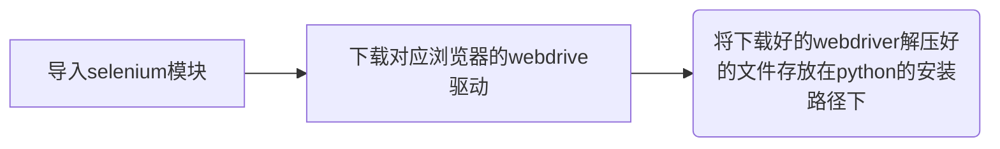

# selenium的基本使用   

#  

# 一、基础使用  


## 1、基本使用  


> 使用前：



1、创建浏览器实例

```
driver = webdriver.Chrome()
```

2、请求网址

```
driver.get(url)
````

3 、关闭浏览器;==driver.quit()== 是退出浏览器; ==driver.close()== 是关闭一个窗口

```
driver.quit()
```

4、打印当前页面的标题

```
print(driver.title)
```

5 、获取当前页面的网址

```
print(driver.current_url)
```

6、获取当前页面的源码|获取某一属性值

```
page_source#获取源码
get_attribute('属性')#获取属性值
```

7、刷新页面

```
driver.refresh()
```

8 、调整窗口

```
driver.set_window_size(400,400)#调整窗口大小，可以自定义
driver.maximize_window()#窗口最大化
driver.minimize_window()#窗口最小化
```

9 、回退和前进页面

```
driver.back()#后退
driver.forward()#前进
```

##   

## 2、定位  


常见的定位手段有#定位 

| 定位       | 例子                                                       |
| ---------- | ---------------------------------------------------------- |
| id         | driver.find_element_by_id('kw')                            |
| class_name | driver.find_element_by_class_name("title-content-title")   |
| link_text  | driver.find_element_by_link_text('视频')                   |
| xpath      | driver.find_element_by_xpath('//*[@id="kw"]')              |
| css        | driver.find_element_by_css_selector('#kw')                 |
| list       | driver.find_elements_by_xpath('//div[@id="s-top-left"]/a') |

##   

## 3、 HTML上框架操作  


因为网页有时候一个大的框架上会有若干小框架，我们需要跳到这个框架上才能进行定位操作。在其他框架操作是无效的。比如，QQ邮箱网页版的登录界面就是在整个大页面上的一个小页面，我们只有跳到这个小页面才能进行登录操作。

iframe是内嵌的网页元素，也可以说是内嵌的框架，Iframe标记又叫浮动帧标记，可以用它将一个HTML文档嵌入在一个HTML中显示。  


  

1、切换到内嵌框架上;只能填id或者name的值 

```
driver.swiech_to.frame('login_frame')
```

#或者先点位到这个框架再切换

```
dd = driver.find_element_by_xpath('') 
driver.swiech_to.frame(dd)
```

3、退出框架，是退出到最外层框架

```
driver.switch_to.default_content()
```

#退出到上一层框架

```
driver.switch_to.parent_frame()
```

#   

# 二、实例：QQ邮箱登录发邮件  


俗话说：光说不练假把式，这里我们整个实例进行练习一下。它是上面基础的总和运用，掌握它你的selenium就已经达到入门，后面我还会讲到一些高级用法，期待你关注。
1、切换到登录框架上

```
driver.switch_to.frame('login_frame')
```

2、输入账号、密码进行登录

```
driver.find_element_by_xpath('//*[@id="u"]').send_keys('2*********9@qq.com')
driver.find_element_by_xpath('//*[@id="p"]').send_keys('n********78*')
driver.find_element_by_xpath('//*[@id="login_button"]').click()
```

3、现在就登录QQ邮箱网页版了，我们可以发邮件了。首先点击写信。这里怕网页反应慢，导致点击失败。我用了一下显性等待。


```
WebDriverWait(driver,20).until(lambda x:x.find_element_by_xpath('//*[@id="composebtn"]')).click()
```

4、进入写信页面又会进入两个框架，我们需要进入框架才能继续操作。


```
driver.switch_to.frame('mainFrame')#进入框架一，然后对收件人和主题进行操作

WebDriverWait(driver,20).until(lambda x:x.find_element_by_xpath('//*[@id="toAreaCtrl"]/div[2]/input')).send_keys('1229720570@qq.com')#写入操作，注意在收件人框的第一个空格位置进行定位

driver.find_element_by_xpath('//input[@id="subject"]').send_keys('通知')#写入主题
```

5、写入正文，正文在框架二里，我们需要进入框架二

```
dd = driver.find_element_by_class_name('qmEditorIfrmEditArea')
driver.switch_to.frame(dd)#这个需要用'先定位到这个框架再切换'
driver.find_element_by_xpath('/html/body[@contenteditable="true"]').send_keys('你好，我是。。。')#现在可以写入正文了
```

6、邮件已经写好，可以进行发送了。因为 <kbd>发送按钮</kbd>在框架一里，这里我们需要回到框架一再点击<kbd>发送</kbd>。

```
driver.switch_to.parent_frame()#退回到框架一
driver.find_element_by_xpath('//*[@id="toolbar"]/div/a[1]').click()#点击发送
```